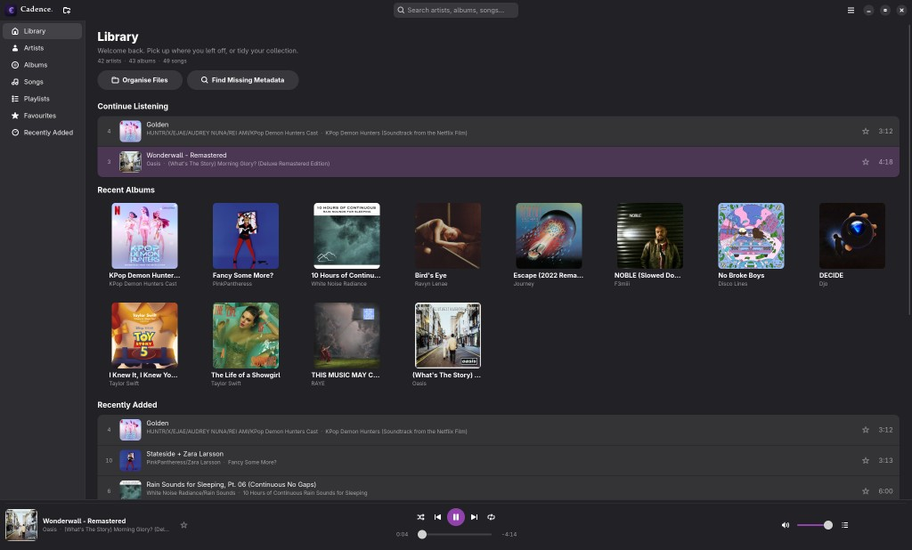

# Cadence.

<p align="center">
  
</p>

<p align="center">
  <strong>A modern, native music library for Linux</strong><br/>
  GTK4 · libadwaita · GStreamer · offline-first · early public beta
</p>

<p align="center">
  <a href="https://github.com/loafdaddy/Cadence-Music/releases/latest"></a>
  <a href="https://www.rust-lang.org/"></a>
  <a href="https://www.gtk.org/"></a>
  <a href="LICENSE"></a>
</p>

<p align="center">
  <a href="https://github.com/loafdaddy/Cadence-Music/releases/tag/v0.1.1">v0.1.1</a>
  ·
  <a href="SETUP.md">Setup</a>
  ·
  <a href="docs/RELEASES.md">Releases</a>
  ·
  <a href="CONTRIBUTING.md">Contributing</a>
  ·
  <a href="docs/README.md">Docs index</a>
</p>

Cadence is a lightweight GTK4 music library for local files. Wayland-first, Flatpak-friendly, no Electron — built to feel like it could ship with Fedora Workstation.

This is an **early public beta** (**v0.1.1**). Features work, but expect rough edges. **Contributors are very welcome** — design, Rust, packaging, docs, and bug reports all help.

> Windows Media Player (Windows 7 era) + GNOME HIG + modern design + native Linux performance.

## Why Cadence?

Most music apps on Linux are either Electron shells or half-finished side projects. Cadence aims for the middle path: a calm, native library browser with honest playback chrome, fast local search, and packaging that respects the desktop.

## Features

- 🎵 Recursive library scan + live folder watching
- 🔍 SQLite + FTS5 search (artists, albums, songs, genres, years, folders)
- 🏠 Library home, Artists, Albums, Songs, Playlists, Favourites
- 🎧 Compact playback dock + optional Now Playing overlay
- ▶️ GStreamer playback with queue, shuffle, and repeat
- 🖼️ Album artwork cache
- 🗂️ Organise as **Artist / Album** or **Artist / Singles**
- ⌨️ MPRIS media keys (play / pause / next / previous)
- 📦 Flatpak-friendly packaging

Architecture details: [docs/ARCHITECTURE.md](docs/ARCHITECTURE.md).

## Screenshots

<p align="center">
  
</p>

<!-- Placeholder for additional shots
<p align="center">
  
</p>
-->

## Quick start

**Flatpak bundle** — no Rust toolchain required. Full walkthrough: **[SETUP.md](SETUP.md)**.

```bash
# Once: Flathub + Platform
flatpak remote-add --if-not-exists --user flathub https://flathub.org/repo/flathub.flatpakrepo
flatpak install --user -y org.gnome.Platform//49

# Download cadence-0.1.1.flatpak from:
# https://github.com/loafdaddy/Cadence-Music/releases/tag/v0.1.1
flatpak install --user ./cadence-0.1.1.flatpak
flatpak run org.cadence.Cadence
```

If you open the `.flatpak` in **GNOME Software** and see two **Local file** options, choose the one tagged **USER**. Details: [SETUP.md](SETUP.md).

Not on Flathub yet — GitHub release bundles and local builds only.

## Docs

| Doc | What it covers |
|-----|----------------|
| **[SETUP.md](SETUP.md)** | Install: Flatpak bundle, Flatpak from clone, from-source |
| [docs/ARCHITECTURE.md](docs/ARCHITECTURE.md) | Crates, threading, shell layout |
| [docs/RELEASES.md](docs/RELEASES.md) | Version history and how to cut a release |
| [docs/TODO.md](docs/TODO.md) / [docs/ROADMAP.md](docs/ROADMAP.md) | Status and direction |
| [docs/FAQ.md](docs/FAQ.md) | Common questions |
| [CONTRIBUTING.md](CONTRIBUTING.md) | Contributor workflow |
| [data/brand/README.md](data/brand/README.md) | Lockup, mark, palette |

## Requirements

| Path | Needs |
|------|-------|
| Flatpak bundle | Flatpak + GNOME Platform 49 (from Flathub, once) |
| Flatpak from clone | `flatpak-builder`, GNOME SDK 49, Rust SDK extension |
| From source | GTK4, libadwaita, GStreamer (base/good/bad), Rust 1.80+ |

Details: [SETUP.md](SETUP.md).

## Configuration

Cadence stores library data under XDG locations (no `.env` file).

| Setting | Where |
|---------|-------|
| Music folders | Preferences → add folders (or empty-state **Add Music Folder**) |
| Scan / reconcile | App menu → **Scan Library** |
| Organise on disk | App menu → **Organise Library** (preview before apply) |
| Metadata | App menu → **Edit Metadata** / **Lookup Metadata** |

Default Flatpak music access is `xdg-music`. Folders outside that path use portal grants when you pick them in the app.

## Usage

1. Add one or more music folders
2. Browse Library / Artists / Albums / Songs, or search from the header
3. Play from any list — the dock stays visible; click artwork for Now Playing
4. Optional: organise files, edit tags, or look up missing metadata

## Development

```bash
git clone https://github.com/loafdaddy/Cadence-Music.git
cd Cadence-Music

# Fedora dependencies
sudo dnf install gtk4-devel libadwaita-devel \
  gstreamer1-devel gstreamer1-plugins-base-devel \
  gstreamer1-plugins-good gstreamer1-plugins-bad-free \
  rust cargo

cargo run -p cadence
```

```bash
cargo test -p cadence-core
cargo fmt
cargo clippy -p cadence-core -p cadence -- -D warnings
```

Full contributor workflow: [CONTRIBUTING.md](CONTRIBUTING.md) · [SETUP.md](SETUP.md).

## Flatpak (from a clone)

```bash
# Once: builders + runtimes (Fedora)
sudo dnf install flatpak-builder flatpak
flatpak remote-add --if-not-exists --user flathub https://flathub.org/repo/flathub.flatpakrepo
flatpak install --user -y org.gnome.Platform//49 org.gnome.Sdk//49 \
  org.freedesktop.Sdk.Extension.rust-stable//24.08

./scripts/build-flatpak.sh
flatpak run org.cadence.Cadence
```

## Releases

Published builds and notes live on GitHub and in [docs/RELEASES.md](docs/RELEASES.md).

| Version | Date | Notes |
|---------|------|-------|
| **[0.1.1](https://github.com/loafdaddy/Cadence-Music/releases/tag/v0.1.1)** | 2026-07-19 | Flatpak clean-install fix (GNOME 49) |
| [0.1.0](https://github.com/loafdaddy/Cadence-Music/releases/tag/v0.1.0) | 2026-07-19 | First public beta (Flatpak superseded) |

## FAQ

**Is Cadence on Flathub?**  
Not yet. Use the GitHub Flatpak bundle or build from source — see [SETUP.md](SETUP.md).

**Does it stream or need an account?**  
No. Cadence is offline-first and works with files on disk.

**Will organise rename my files without asking?**  
No. Organisation only runs when you open **Organise Library**, preview the plan, and apply.

**Can I use AI tools to contribute?**  
Yes. See [CONTRIBUTING.md](CONTRIBUTING.md#ai-assisted-contributions).

More answers: [docs/FAQ.md](docs/FAQ.md).

## Upcoming

From [docs/ROADMAP.md](docs/ROADMAP.md) (day-to-day items: [docs/TODO.md](docs/TODO.md)):

- Finish dead wiring — portraits, MPRIS honesty, playlist/queue UX
- Stronger browsers — album page, genres, scalable search
- Large-library readiness — virtualization where it counts
- Packaging — clean Flatpak path; Flathub after the beta holds up

## Contributing

See [CONTRIBUTING.md](CONTRIBUTING.md). Focused PRs and AI-assisted contributions are welcome.

Parts of Cadence — including code, docs, branding, and packaging — may have been written or edited with AI assistance. Contributors remain responsible for what they submit.

## License

GPL-3.0-or-later. See [LICENSE](LICENSE).
