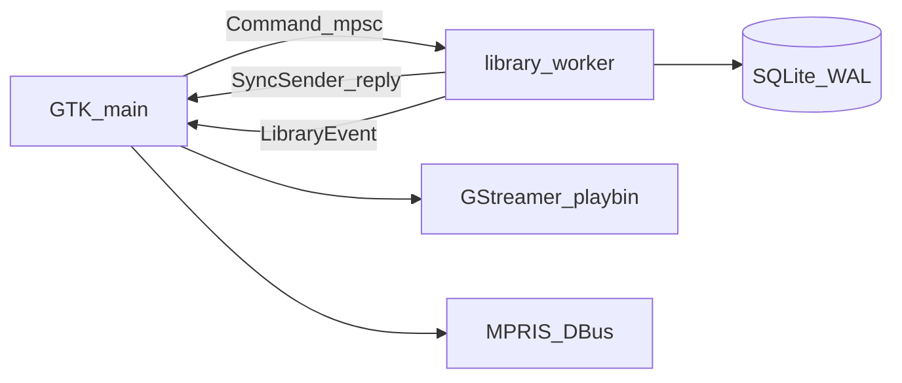
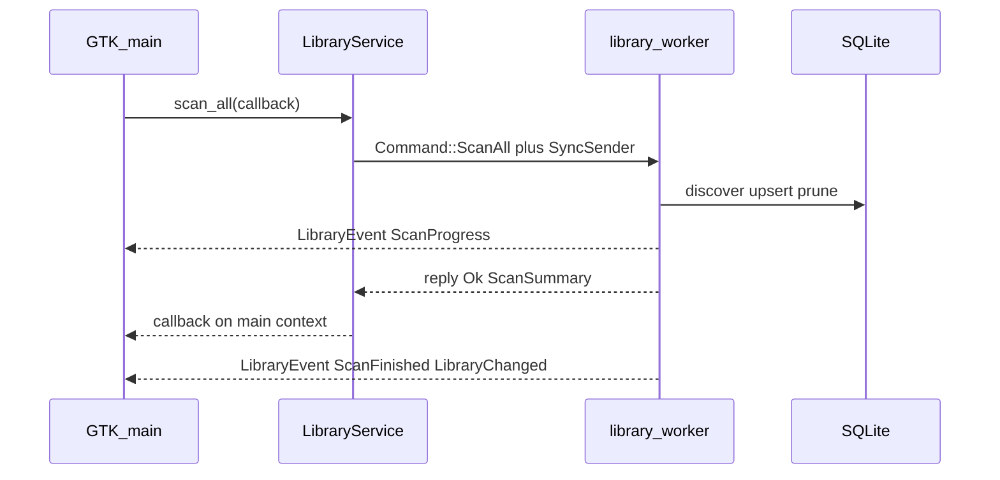
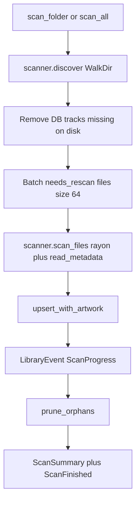

# Architecture

Technical guide for contributors. Read this to learn how Cadence is structured, where work runs, and which invariants you must not break.

| Doc | Use when |
|-----|----------|
| [CONTRIBUTING.md](../CONTRIBUTING.md) | Clone, build loop, PR expectations |
| [SETUP.md](../SETUP.md) | Flatpak / from-source install |
| [TODO.md](TODO.md) | What is done, partial, or next |
| [ROADMAP.md](ROADMAP.md) | Direction and non-goals |

## Contents

- [Big picture](#big-picture)
- [Repo map](#repo-map)
- [Startup](#startup)
- [Threading model](#threading-model)
- [cadence-core](#cadence-core)
- [Database](#database)
- [Scanner and watcher](#scanner-and-watcher)
- [UI shell and navigation](#ui-shell-and-navigation)
- [Playback](#playback)
- [Organisation, metadata, artwork, lookup](#organisation-metadata-artwork-lookup)
- [Flatpak](#flatpak)
- [Contributor invariants](#contributor-invariants)
- [Where to start](#where-to-start)

---

## Big picture

Cadence is a **native Linux desktop app**: GTK4 / libadwaita UI over a SQLite library engine, with GStreamer for playback. Offline-first — local files only; network is used for optional MusicBrainz / Cover Art Archive lookup.

Two crates:

| Crate | Path | Role |
|-------|------|------|
| `cadence-core` | [`crates/core`](../crates/core) | SQLite, scanner, watcher, tags (lofty), artwork cache, organise planner, lookup — **no GTK / GStreamer** |
| `cadence` | [`crates/app`](../crates/app) | Binary: UI, `LibraryService` bridge, playback, MPRIS |



Constants shared across desktop entry, icons, and MPRIS live in core:

- `APP_ID` = `org.cadence.Cadence`
- `APP_NAME` = `Cadence`
- `APP_WORDMARK` = `Cadence.`

---

## Repo map

| Path | Purpose |
|------|---------|
| [`Cargo.toml`](../Cargo.toml) | Workspace; members `crates/core`, `crates/app`; shared deps |
| [`crates/core/`](../crates/core) | Library engine |
| [`crates/app/`](../crates/app) | GTK binary |
| [`data/`](../data) | Desktop entry, AppStream metainfo, icons, [`data/brand/`](../data/brand) |
| [`build-aux/`](../build-aux) | Flatpak manifest |
| [`scripts/`](../scripts) | `build-flatpak.sh`, `run-debug.sh` |
| [`docs/`](./) | This guide, TODO, releases, FAQ |
| [`SETUP.md`](../SETUP.md) / [`CONTRIBUTING.md`](../CONTRIBUTING.md) | Install and contributor workflow |
| `.envrc.build` | Optional local deps prefix for from-source builds |

App ID and packaging files: `data/org.cadence.Cadence.desktop`, `data/org.cadence.Cadence.metainfo.xml`, `data/icons/hicolor/scalable/apps/org.cadence.Cadence.svg`.

---

## Startup

```text
main.rs
  → tracing (default filter "info")
  → configure_gstreamer_plugins()   // host plugin paths if GST_* unset
  → gstreamer::init()
  → application::run()
       → adw::Application (application_id = APP_ID)
       → startup: register data/icons, load ui/style.css
       → activate: CadenceWindow::new → present
```

Key files:

| Step | File |
|------|------|
| Entry + GStreamer env | [`crates/app/src/main.rs`](../crates/app/src/main.rs) |
| App, About, CSS, icons | [`crates/app/src/application.rs`](../crates/app/src/application.rs) |
| Shell, wiring, nav | [`crates/app/src/window.rs`](../crates/app/src/window.rs) |

`CadenceWindow::new` roughly:

1. `LibraryService::start()` — spawns worker thread `"cadence-library"`
2. Build header, nav, detail stack, playback dock, Now Playing overlay
3. `Player::new` — bus events polled on the main context
4. Start MPRIS (`mpris::start_mpris`)
5. Wire menus, search, views, library events
6. `list_folders`: empty → `EmptyState`; else show Library and **`scan_all`**

Actions: `app.quit` (`<Primary>q`), `app.about`, `win.preferences` (`<Primary>comma`), plus window actions for scan / organise / metadata.

---

## Threading model

This is the most important mental model for contributors.

| Context | Owns |
|---------|------|
| **GTK main** | All widgets, GStreamer bus watch, MPRIS async, position timer (~250ms), every `LibraryService` callback |
| **`"cadence-library"`** | One `Database` connection; command loop; folder watcher debounce; scans; organise execute; tag write; most lookups |
| **`"cadence-metadata-fill"`** | Spawned for `fill_missing_metadata`; opens its **own** `Database::open`; progress via `LibraryEvent`; guarded by `fill_running` |
| **notify thread** | Raw filesystem events → watcher channel (drained by the library worker) |

### How UI talks to the library

[`LibraryService`](../crates/app/src/services/library_service.rs):

| Channel | Direction | Pattern |
|---------|-----------|---------|
| `Command` mpsc | UI → worker | Fire command with embedded `SyncSender` |
| Per-call reply | Worker → UI | `SyncSender<Result<T>>` (capacity 1); UI polls with `glib::timeout_add_local` every **10ms** |
| `LibraryEvent` mpsc | Worker → UI | Polled every **50ms** via `attach_events` |



### `LibraryEvent`

```rust
ScanProgress { done, total }
ScanFinished { summary: ScanSummary }  // added / removed / updated
LookupProgress { phase, done, total }
LibraryChanged
Error(String)
```

`ScanSummary::toast_message()` only returns text when `added` or `removed` is non-zero (updates-only scans stay quiet).

### Rules of thumb

- The UI **never** opens SQLite or does blocking disk/network I/O on the main thread.
- The library worker **never** touches GTK widgets or the GStreamer pipeline.
- Fill runs on a second DB connection (WAL) so browsing can continue; do not assume exclusive writers during fill.

---

## cadence-core

[`crates/core/src/lib.rs`](../crates/core/src/lib.rs) — `#![forbid(unsafe_code)]`, no GUI deps.

| Module | Path | Responsibility |
|--------|------|----------------|
| `models` | `models.rs` | `Track`, `Album`, `Artist`, `Playlist`, `TrackDisplay`, `TrackMetadata`, id newtypes |
| `db` | `db/` | `Database`, migrations, queries, FTS |
| `scanner` | `scanner/` | `discover`, `scan_files`, `LibraryWatcher` / `WatchEvent` |
| `metadata` | `metadata/` | lofty `read_metadata` / `write_metadata`, `missing_fields` |
| `organization` | `organization/` | `Template`, `Preset`, `OrganizationPlan`, `UndoLog` |
| `artwork` | `artwork/` | `artwork_key`, `extract_and_cache` |
| `lookup` | `lookup/` | MusicBrainz / CAA / artist image helpers |
| `paths` | `paths.rs` | XDG data/cache locations |
| `error` | `error.rs` | `Error`, `Result` |

### On-disk locations

| Helper | Location |
|--------|----------|
| `library_db_path()` | `$XDG_DATA_HOME/cadence/library.db` |
| `artwork_cache_dir()` | `$XDG_CACHE_HOME/cadence/artwork` |
| `artist_image_cache_dir()` | `$XDG_CACHE_HOME/cadence/artists` |
| `lookup_cache_dir()` | `$XDG_CACHE_HOME/cadence/lookup` |

Keep GUI-free: if a feature needs GTK or GStreamer types, it belongs in `crates/app`, not core.

---

## Database

Opened with WAL, `synchronous=NORMAL`, `foreign_keys=ON`. Migrations use `PRAGMA user_version`; current target is `LATEST_VERSION = 2` ([`schema.rs`](../crates/core/src/db/schema.rs)).

### Tables (V1)

| Table | Notes |
|-------|-------|
| `artists` | `name` UNIQUE; V2 adds `image_path`, `mbid` |
| `albums` | UNIQUE `(name, album_artist_id)`; `artwork_path`, year, genre, compilation |
| `tracks` | `path` UNIQUE; tag fields; `file_size` / `modified_at` for cheap rescan; play_count, favorite |
| `library_folders` | Roots Cadence indexes |
| `playlists` / `playlist_tracks` | Position in PK |
| `play_history` | For continue / recent |

### FTS5

```sql
CREATE VIRTUAL TABLE track_search USING fts5(title, artist, album);
```

- Kept in sync **explicitly** by `reindex_search` on upsert; deleted when a track is removed (`rowid = track.id`).
- Search builds prefix terms per whitespace word; UI requests are capped (service search limit **200**).
- Any new mutation path that changes searchable text **must** update `track_search`.

### Behaviours to know

- `upsert_track`: conflict on `path` — preserves `play_count` / `favorite` across rescans.
- `track_needs_rescan`: size or mtime change.
- `prune_orphans`: after scan / track removal (empty albums, unreferenced artists).
- `Database::remove_*` = **library only**. Disk delete is app-layer (`remove_tracks_and_files` in `LibraryService`).

---

## Scanner and watcher



### Full scan

Implemented in `scan_folder` inside [`library_service.rs`](../crates/app/src/services/library_service.rs):

1. `scanner::discover(root)` — WalkDir, no symlink follow, skip dotfiles, map extension → `AudioFormat`
2. Drop DB rows for files that disappeared under that root
3. Rescan only when size/mtime changed; parse in parallel via rayon
4. Upsert + extract embedded artwork if the album has none
5. `prune_orphans`; emit progress / finished events

Triggers: startup (when folders exist), menu **Scan Library** (`win.scan-library`), after **Add folder**.

Corrupt tags skip that file; they do not abort the whole library.

### Watcher

- `LibraryWatcher` (notify) → `WatchEvent::Upserted` / `Removed`
- Worker debounces **500ms**, then `ingest_path` or remove-by-path → `LibraryChanged`
- Watched on worker start and `AddFolder`; unwatched on `RemoveFolder`

---

## UI shell and navigation

Built in [`window.rs`](../crates/app/src/window.rs).

```text
ApplicationWindow
└─ ToastOverlay
   └─ ToolbarView
      ├─ HeaderBar
      │    brand | Add folder | SearchEntry | lookup Spinner | menu
      └─ Overlay
         ├─ library_shell
         │  ├─ Banner          (scan progress)
         │  ├─ panes: Nav | [master Artists] | detail Stack
         │  └─ PlayerBar       (~96px fixed dock)
         └─ Revealer → NowPlaying   (overlay; can_target only when open)
```

### Navigation

`enum Nav` — Library, Artists, Albums, Songs, Playlists, Favourites, Recent.

`show_nav` toggles master pane visibility and the detail stack child.

| Stack name | Widget |
|------------|--------|
| `home` | `LibraryHome` |
| `artist` | `ArtistDetail` (with `ArtistsView` in master) |
| `albums` | `AlbumsView` |
| `songs` | `SongsView` (`PAGE_SIZE = 500`) |
| `playlists` | `PlaylistsView` |
| `queue` | `QueueView` (dock toggle; restores `previous_detail`) |
| `search` | `SearchResults` |
| `empty` | `EmptyState` |

Widgets live under [`crates/app/src/ui/`](../crates/app/src/ui/). Dialogs: `OrganizeDialog`, `MetadataDialog`, `PreferencesWindow`. Artwork helpers: `artwork_frame`, `set_artwork_file` (decode at display size so dock height cannot grow).

### App menu

Preferences · Scan Library · Organise Library · Edit Metadata · Lookup Metadata · Undo Organisation · About · Quit.

Home also exposes Organise and Find Missing Metadata; **Scan** is menu-only.

Brand: header icon + wordmark **Cadence.** (Cantarell / Adwaita Sans, purple `#A882FF` period). See [`data/brand/README.md`](../data/brand/README.md).

---

## Playback

One engine, two surfaces.

| Piece | File | Role |
|-------|------|------|
| `Player` | [`playback/player.rs`](../crates/app/src/playback/player.rs) | GStreamer `playbin` (`cadence-playbin`); video → `fakesink` |
| `Queue` | [`playback/queue.rs`](../crates/app/src/playback/queue.rs) | Ordered tracks, shuffle, `RepeatMode::{Off,All,One}` |
| Dock | `ui/player_bar.rs` | Compact always-on bar |
| Now Playing | `ui/now_playing.rs` | Overlay from dock artwork |
| MPRIS | [`mpris.rs`](../crates/app/src/mpris.rs) | `org.mpris.MediaPlayer2.Cadence` |

`AppState` holds `Rc<Player>` and `RefCell<Queue>`. Dock and Now Playing share them.

- Bus → `PlayerEvent` on main context; UI also polls `position_ns` / `duration_ns` (~250ms).
- `start_track` / `play_list` / `play_next` in `window.rs`; play history recorded via library; MPRIS updated on track start.
- Queue has `jump_to` / `remove` — **UI not wired yet** (see [TODO.md](TODO.md)).

### MPRIS today

Wired: Play, Pause, PlayPause, Stop, Next, Previous (media keys).

Known gaps: dock pause may not refresh client status; `can_seek` / `can_raise` advertised but unwired. Prefer honesty over claiming features — see TODO.

---

## Organisation, metadata, artwork, lookup

### Organisation

Opt-in only. Flow is always preview → user confirm → apply → optional undo.

- Default `Template::Preset(Preset::ArtistAlbum)`:
  - with album: `{albumartist}/{album}/{track2} {title}`
  - without: `{albumartist}/Singles/{title}`
  - compilations → top-level `Compilations/`; multi-disc → `Disc N/`
- Preview builds `OrganizationPlan` (no disk writes).
- Apply renames, prunes empty parents, updates DB paths; `UndoLog` kept in `AppState.last_undo` (**in-memory only** — lost on quit).

### Metadata

- Read/write only through `cadence_core::metadata` (lofty).
- Edit dialog → `write_metadata` + `ingest_path` on the worker.
- Never overwrite user tags from lookup without an explicit write path.

### Artwork

- Embedded extract → cache file named from `artwork_key(album_artist, album)` (sha256) under `artwork_cache_dir()`.
- UI must use `artwork_frame` + `set_artwork_file` so textures load at display size.

### Lookup

| API | Behaviour |
|-----|-----------|
| `lookup_recording` | MusicBrainz search; optional CAA front URL |
| `LookupResult::apply_missing_only` | Fills empty fields only |
| `fill_missing_metadata` | Album art / genre / year pass; progress events; **does not** download artist portraits today |
| `lookup_and_fill` (per track) | Exists on the service — **UI never calls it**; does not write tags by itself |

### Dead wiring (do not claim done)

From [TODO.md](TODO.md) — code exists but is incomplete or unused:

- Artist portraits: `artists_missing_image`, `download_artist_image`, `set_artist_image` — fill never calls them; UI never reads `image_path`
- Per-track `lookup_and_fill` — unused from UI
- `delete_playlist`, `remove_folder` — no prefs/UI entry points
- Queue `jump_to` / `remove` — unused by UI
- Search → Folder activation — toast only

---

## Flatpak

| Touchpoint | Detail |
|------------|--------|
| Manifest | [`build-aux/org.cadence.Cadence.yml`](../build-aux/org.cadence.Cadence.yml) |
| Runtime | GNOME Platform / Sdk **49** + `org.freedesktop.Sdk.Extension.rust-stable` |
| Command | `cadence` → `/app/bin/cadence` |
| Script | [`scripts/build-flatpak.sh`](../scripts/build-flatpak.sh) — user install + export bundle with Flathub `--runtime-repo` |
| Bundle | App-only (few MB); needs Platform from Flathub once |

Important `finish-args`:

- Wayland / X11, PulseAudio, DRI, network
- Portals: Documents, FileChooser, OpenURI, Notification
- `--own-name=org.mpris.MediaPlayer2.Cadence`
- `--filesystem=xdg-music:rw` — folders outside XDG Music need document portal grants via `FileDialog`

Install walkthrough: [SETUP.md](../SETUP.md). Release process: [RELEASES.md](RELEASES.md).

---

## Contributor invariants

1. **UI thread must not open the DB** or do blocking disk/network I/O — use `LibraryService` continuations.
2. **`Database` is not `Sync`** — one connection on the library worker; fill opens a second deliberately.
3. **Never touch GStreamer or GTK from the library worker.**
4. **Artwork UI:** `artwork_frame` / `set_artwork_file` only; dock height stays ~96px.
5. **Now Playing collapsed:** `can_target = false` or the overlay steals clicks.
6. **Organisation is opt-in:** preview → apply; never silently rename.
7. **Lookup fills missing fields only** unless the user explicitly edits/writes tags.
8. **`LibraryService::remove_tracks` / `remove_album` delete files on disk** — distinct from `Database::remove_*`.
9. **Scanner:** skip hidden files and symlinks; bad tags skip the file, not the library.
10. **FTS is manual** — new track mutation paths must reindex / delete `track_search` rows.
11. **`cadence-core` stays GUI-free** — no gtk / gstreamer deps in core.
12. **Brand:** Cadence purple (`#A882FF`); do not restyle toward Discoverr teal. No emoji in UI strings.
13. **MPRIS honesty** — do not advertise seek/raise/pause sync until clients update correctly.
14. **Do not claim TODO items done** unless verified in the running app.

---

## Where to start

Aligned with [TODO.md](TODO.md) **Next** / dead wiring. Prefer small PRs that finish existing APIs.

| Area | Start here | Why |
|------|------------|-----|
| MPRIS pause / status | `crates/app/src/mpris.rs`, `window.rs` | Small, high visibility |
| Queue jump / remove | `ui/queue_view.rs`, `playback/queue.rs`, `window.rs` | Core API exists |
| Playlist delete / rename | `ui/playlists_view.rs`, `LibraryService::delete_playlist` | DB/service ready |
| Context-menu Edit Metadata | `ui/context_menu.rs`, `metadata_dialog.rs`, `window.rs` | Explicit TODO |
| Artist portraits end-to-end | `lookup`, `db.set_artist_image`, fill pass, Artists UI | Helpers ready; UI/fill unwired |
| Preferences remove folder | `ui/preferences.rs`, `remove_folder` | Partial prefs |
| Search folder activation | `ui/search_results.rs`, `window.rs` | Toast-only today |
| Home recent albums chronology | `ui/library_home.rs`, DB recent queries | Known wrong heuristic |
| Docs / Flatpak testing | `SETUP.md`, `scripts/build-flatpak.sh` | Always welcome |
| Core unit tests | `cargo test -p cadence-core` | Safe sandbox |

### Verify locally

```bash
cargo test -p cadence-core
cargo fmt
cargo clippy -p cadence-core -p cadence -- -D warnings
cargo run -p cadence
# or: ./scripts/run-debug.sh
```

Flatpak: `./scripts/build-flatpak.sh` then `flatpak run org.cadence.Cadence`.

### Avoid as a first PR

Large list virtualization, Flathub publish, gapless / ReplayGain, or a wholesale shell/brand rewrite — unless you are coordinating with maintainers.

---

## Quick reference

```text
CadenceWindow (AppState)
  library: LibraryService  --mpsc Command-->  "cadence-library"
       ^                                        | Database + LibraryWatcher
       |-- SyncSender reply -- glib 10ms poll --|
       |-- LibraryEvent ---- glib 50ms poll ----|
  player: Rc<Player>       <-- gst bus watch (main)
  queue: RefCell<Queue>
  mpris: Rc<MprisService>  <-- D-Bus --> player/queue
  UI refreshes on LibraryChanged / Scan* / LookupProgress
```

When in doubt: follow an existing `LibraryService::…` call site in `window.rs`, keep work off the UI thread, and check [TODO.md](TODO.md) before claiming a feature finished.
